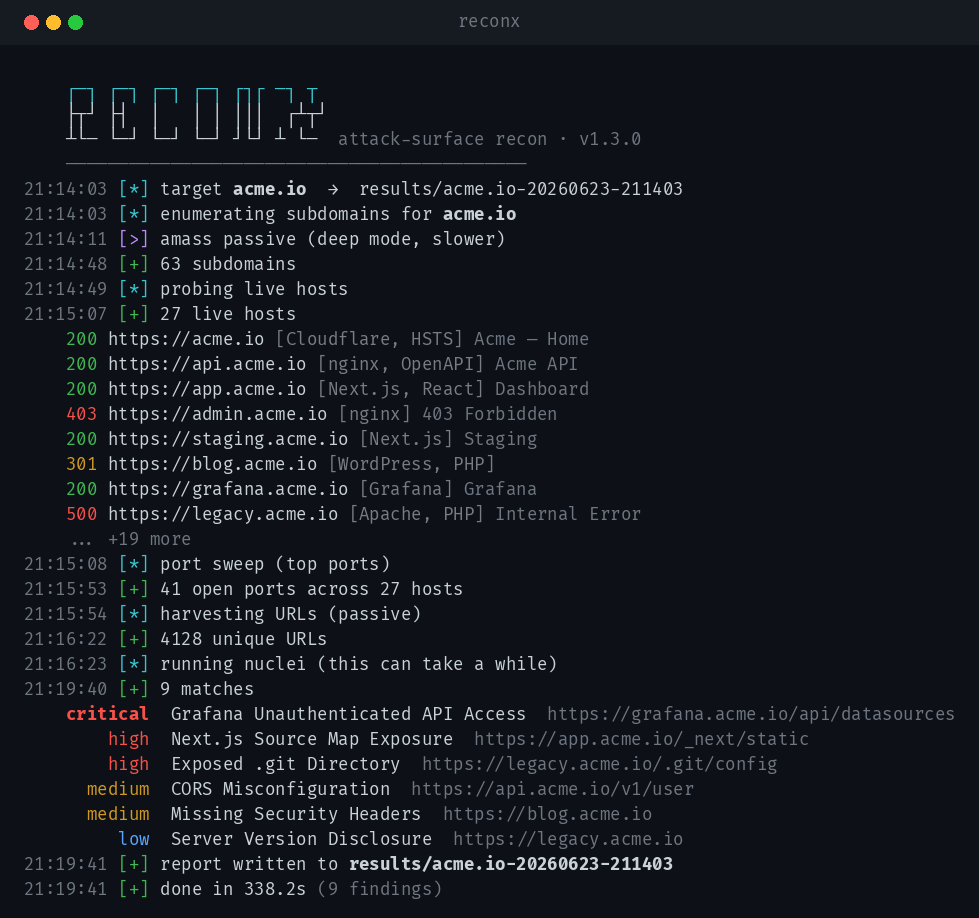

# reconx

A single-file attack-surface recon pipeline. It chains subdomain discovery,
live-host probing, port sweeping, passive URL harvesting and template
scanning into one reproducible run with structured output.

Built around the [ProjectDiscovery](https://github.com/projectdiscovery)
toolchain — reconx orchestrates them, normalizes the results and writes a
clean report you can drop straight into an engagement.



## Install

```bash
git clone https://github.com/d3xm0s/reconx
cd reconx
chmod +x reconx.py
```

No Python dependencies beyond the stdlib. The external scanners are optional —
any missing tool simply degrades that stage instead of failing the run.

| stage         | tool                  |
|---------------|-----------------------|
| subdomains    | `subfinder`, `amass`  |
| probing       | `httpx`               |
| ports         | `naabu`               |
| url harvest   | `gau`, `waybackurls`  |
| scanning      | `nuclei`              |

```bash
# ProjectDiscovery installer
go install github.com/projectdiscovery/subfinder/v2/cmd/subfinder@latest
go install github.com/projectdiscovery/httpx/cmd/httpx@latest
go install github.com/projectdiscovery/naabu/v2/cmd/naabu@latest
go install github.com/projectdiscovery/nuclei/v3/cmd/nuclei@latest
```

## Usage

```bash
./reconx.py acme.io                 # full pipeline
./reconx.py acme.io --deep          # add amass passive enum
./reconx.py acme.io --no-scan       # recon only, skip nuclei
./reconx.py acme.io --severity high,critical
```

Flags:

```
-o, --output DIR     output directory (default: results)
-t, --threads N      probe concurrency (default: 40)
--severity LIST      nuclei severities (default: low,medium,high,critical)
--scan-timeout SEC   nuclei stage timeout (default: 1800)
--deep               include amass passive enumeration
--no-ports           skip port sweep
--no-urls            skip passive URL harvesting
--no-scan            skip nuclei
--no-color           plain output
```

## Output

Each run lands in its own timestamped directory:

```
results/acme.io-20260623-211403/
├── subdomains.txt
├── live.txt
├── ports.txt
├── urls.txt
├── nuclei.jsonl
├── findings.json     # full structured result
└── report.md         # human-readable summary
```

`findings.json` is the machine-readable source of truth; `report.md` is a
ready-to-paste summary table.

## Notes

Use only against assets you are authorized to test. Passive stages are quiet,
but `naabu` and `nuclei` are active and will show up in target logs — scope
them with the `--no-*` flags when needed.

## License

MIT
d3xm0s
